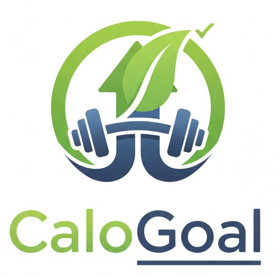
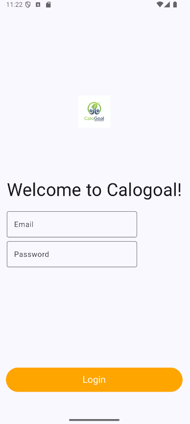
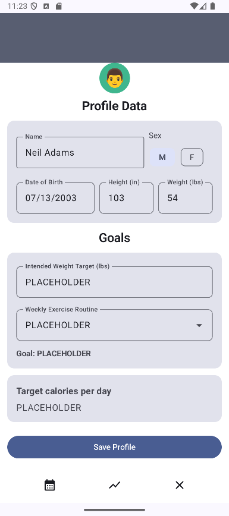
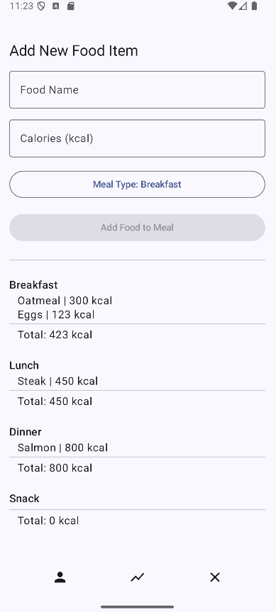
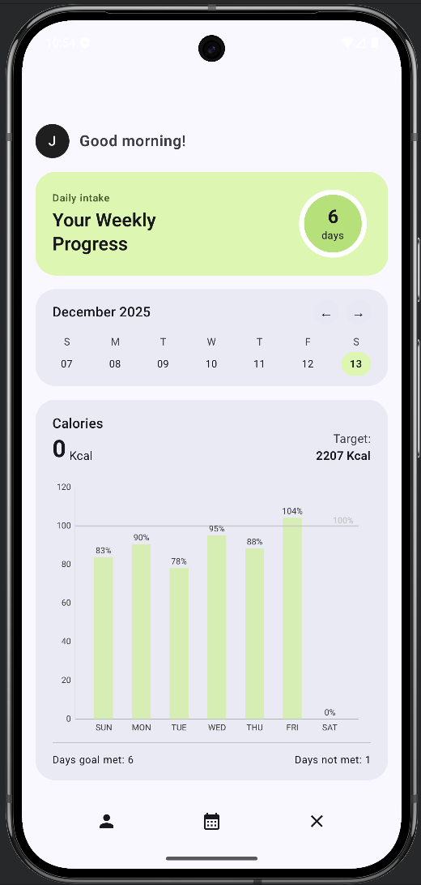

# Calogoal
*This app was created for CS 639 Mobile App Development at Pace University in Fall 2025.*



### About this app
Calogoal helps users reach their fitness and wellness goals by giving them a central hub to track their meals and caloric intake.

### [Our Learning Experience](Resources/Pages/EXPERIENCE.md)
### [Idea Proposal](https://docs.google.com/document/d/1d66QySOIP4ZJdojzy5ZrcAySyJDUOEVEPDgrvcebG6o/edit?usp=sharing)

## Meet the Team
- [Christos Markakis](https://github.com/Crisptos)
- [James Ambenge](https://github.com/James-Ambenge)
- [Mohammed Yusif](https://github.com/MYNazir)

## Main Features
- Login
- Meal Tracking
- Progress Visualization (Trend Tracking)
- Personalized Profile Management
- Persistent User Data

## Get the APK Here!
- [Install](Resources/APKs/)

## App Screenshots





## Design Prototypes
- [Prototype Screenshots](Resources/Screenshots/Prototypes/)

## Project SCRUM
- [Sprint 0 Planning](https://docs.google.com/document/d/17g0jBYmdpKuCQCGjdx6dWtfA1c_6MxLT6-wohyKQZ14/edit?usp=sharing)
- [Sprint 1 Planning](https://docs.google.com/document/d/1dGdhnn08Mpo2ZqpmlPQtRdAuSLIJUu742ihnchltM-g/edit?usp=sharing)
- [Sprint 1 Demo Screenshots](Resources/Screenshots/Sprint%201/)
- [Sprint 1 Retro](https://docs.google.com/document/d/1Ab8o-j5xBMVAiKxRQW-9uJCEfjKs9YGnmUIVqijAen8/edit?usp=sharing)
- [Sprint 2 Planning](https://docs.google.com/document/d/14BCo-_KmHMnM3SM0r_jvDM0kuW1BSgLlzWyP339HzLA/edit?usp=sharing)
- [Sprint 2 Demo Video](Resources/Videos/demo.mp4)
- [Sprint 2 Retro](https://docs.google.com/document/d/19n-iM_aDQvFrdy6UwczumtnhrqlFRKX6FAl2-A4M0vc/edit?usp=sharing)

## Find the Demo Video on Youtube Here!
[](https://youtu.be/K96olJLMpYM)

## Firestore Database Schema
```
└── users/
    ├── [unique UID]/
    ├── [unique UID]/
    └── [unique UID]/
        ├── dateOfBirth
        ├── height
        ├── weight
        ├── name
        ├── sex
        └── meals/
            └── [unique meal ID]/
                ├── label
                ├── calories
                ├── protein
                ├── fat
                └── carbs
```

## Technologies Used
| Library | Use |
|:-------------|:---------------|
| [Jetpack Compose](https://developer.android.com/jetpack/compose) | Declarative UI Toolkit |
| [MPAndroidChart](https://github.com/PhilJay/MPAndroidChart) | Charts |
| [Material Design 3](https://m3.material.io/develop/android/compose)  | UI Components |
| [Firebase](https://firebase.google.com/docs/firestore)  | User Logins and Database |
| [Hilt](https://developer.android.com/training/dependency-injection/hilt-android)  | Dependency Injection & View Models |

## Github Insights
